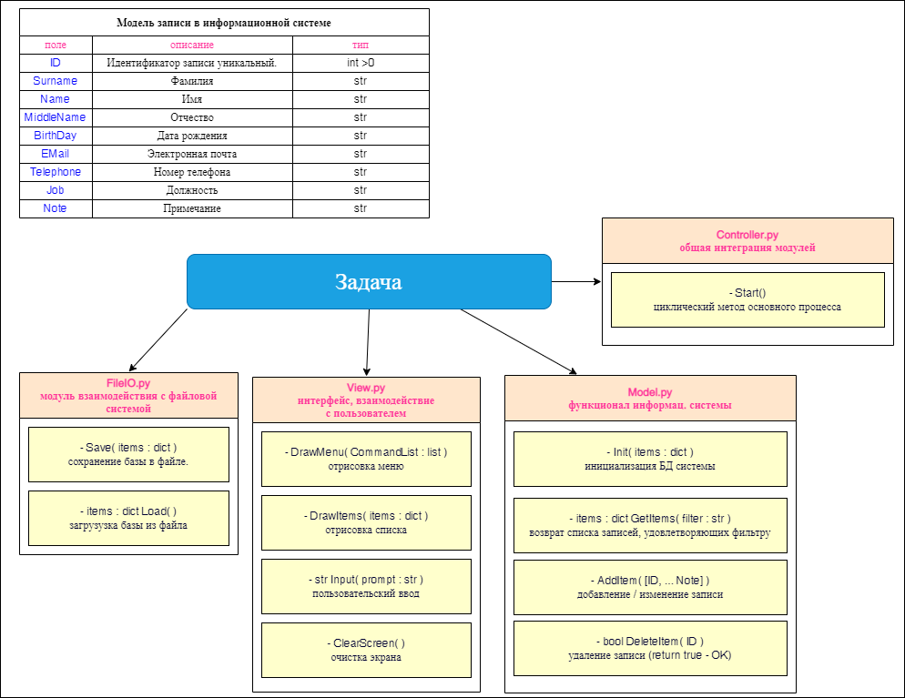

# PythonTeamWork1

## Групповая работа по созданию информационной системы (список сотрудников)

Задача:

_Создать информационную систему позволяющую работать с сотрудниками некой компании \ студентами вуза \ учениками школы_

__Участники:__

- Иван Давыдов - руководитель проекта, функционал ([main.py](Progect/main.py), [Model.py](Progect/Model.py), [Controller.py](Progect/Controller.py))
<https://github.com/dia-zx/PythonTeamWork1>
- Михаил Мансуров - интерфейс ([View.py](Progect/View.py))
- Анатолий Разоренов - операции с файловой системой ([FileIO.py](Progect/FileIO.py))

[план решения](Plan.png)

