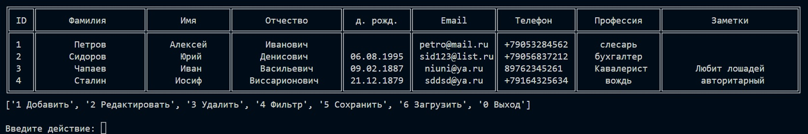

# PythonTeamWork1

## Групповая работа по созданию информационной системы (список сотрудников)

Задача:

*Создать информационную систему позволяющую работать с сотрудниками некой компании \ студентами вуза \ учениками школы*

__Участники:__

- Иван Давыдов - руководитель проекта, функционал ([main.py](main.py), [Model.py](Model.py), [Controller.py](Controller.py))
<https://github.com/dia-zx/PythonTeamWork1>
- Михаил Мансуров - интерфейс ([View.py](View.py))
<https://github.com/Mansurov512/PythonTeamWork1>
- Анатолий Разоренов - операции с файловой системой ([FileIO.py](FileIO.py))
<https://github.com/molleux/PythonTeamWork1>

[план решения](images/Plan.png)

Для разработки проекта использовался язык Python 3.10

Для запуска проекта необходимо:

- установить среду [Python3](https://www.python.org/downloads/);
- склонировать данный репозиторий, на локальный диск (ветку release);
- перейти в папку с файлами проекта ("main.py", ...);
- запустить на исполнение файл [main.py](main.py) в коммандной строке.

---
## Работа с информационной системой 

Данный проект реализует основной необходимый функционал по работе с базой данных сотрудников:

- добавление \ удаление записи о сотруднике;
- редактирование существующей записи;
- вывод записей, удовлетворяющих текстовому фильтру;
- запись \ сохранение на диске содержимого БД (файл [base](base)).

Внешний вид интерфейса проекта представлен на рисунке:

